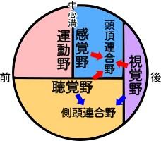

# Virtual Reality
教科書：『[バーチャルリアリティ学](https://amzn.to/3uGdfYU)』

### 1.1.1 バーチャルの意味

* Existing in essence or effect though not in actual fact or form  
* みかけや形はそのものではないが、本質的あるいは効果としてはそのものである
* virtual（実質･本質）≒ real（実）
* supposed（仮想）≒ nominal（名目･表層）≒ imaginary（虚）
* バーチャルマネー、バーチャルプレジデント、バーチャルカンパニー
* バーチャルイメージ（=虚像？）、仮想敵国（≠​バーチャルエニミー）

### 1.1.2 バーチャルリアリティとその三要素

* みかけは現実ではないが、実質的には現実である
* ①三次元空間（三次元映画等）
* ②実時間相互作用（コンピュータゲーム等）
* ③自己投射（感覚モダリティの一致）

### 1.1.3 バーチャルリアリティと人間の認知機構

* 人間の感覚器による一種のバーチャルな世界（脳に投影された物自体の写像）
* 視覚･聴覚･触覚･味覚･嗅覚
* 印刷物やテレビ（色彩におけるVR）
* VRとテレイグジスタンス

### 1.1.4 バーチャルリアリティの概念と日本語訳

* 日本：実体のない仮想（supposed）としてのバーチャル
* 欧米：見た目は違うがほとんど実物（real）としてのバーチャル
* VR ≒ 人工現実感（≠​仮想現実感）

### 1.1.5 道具としてのバーチャルリアリティ

* 3Cと3Eのための道具
* ①創造（**C**reation）のための道具…創造活動･創作活動の支援
* ②制御（**C**ontrol）のための道具…ロボット･機器の制御
* ③通信（**C**ommunication）のための道具…次世代電話
* ④解明（**E**lucidation）のための道具…科学的発見のためのツール
* ⑤教育（**E**ducation）のための道具…シュミレータ
* ⑥娯楽（**E**ntertainment）のための道具…ゲーム･旅行

### 1.2.1 VRの基本構成要素

* ①出力システム（五感のディスプレイ）
* ②入力システム（データグローブ･位置計測･身体計測など）
* ③シュミレーションシステム（物理現象などのシュミレーション）

### 1.2.2 VR世界のいろいろ

* シュミレーションゲーム（計算機内で閉じられたもの）
* VR世界と遠方の世界を接続（テレイグジスタンス･テレプレゼンス）

### 1.2.3 VRをどうとらえるか

* AIPキューブ  
    * **A**utonomy（自律性）…シュミレーションシステム
    * **I**nteraction（対話性）…直観的入力システム
    * **P**resence（臨場感）…高臨場型ディスプレイ
    * 全天周シアター(0,0,1)、TVゲーム(0.5,0.5,0.5)
* ヒューマンインタフェース  
    * 人とシステム：三人称的（対面的に眺める）
    * 人とVR：一人称的（内側から眺める･没入的）
* インターフェースの方式  
    * 旧来：メタファ（記号的恣意性）の多用
    * VR：身体的（記号的恣意性が極少）

### 1.3 VRの歴史

* コンピュータ登場以前
    * 1億8000年前：南仏ラスコー洞窟の壁画
    * 18～19世紀：全天周絵画パノラマ（画家Robert Barkerによる手法）
    * 1900年：ムービングパノラマ（Mareoramaの作品）
* コンピュータグラフィック分野
    * 1967年：GROPEプロジェクト（F.Brooks･マスターアームでCG映像に触る）
    * 1968年：最初のHMD（I.Sutherland "Ultimate Display"）
* インタラクティブアート分野
    * 1969年：インタラクティブアート（M.Krueger "METAPLAY" "Videoplace"）
* アミューズメント･ゲーム分野
    * 1963年：SENSORAMA（M.Heiligのバイク体感型ゲーム）
* 航空宇宙分野
    * 1982年：スーパーコックピット（T.Furness･HMDを使った戦闘機）
    * 1985年：NASA Virtual Enviromnment（宇宙船内コックピット設計）
* ヒューマンインタフェース分野
    * 1981年：MIT "Media Room"（部屋全体を利用した空間型インターフェース）
* ロボット工学分野
    * 1982年："TELESA"（テレイグジスタンスロボット）
    * 1983年："Greenman"（テレプレゼンスロボット）
* 1989年："VR"という言葉が登場（米VPL社 EyePhoneとDataGlove） 

### 2.1.1 脳神経系の解剖学的構造と神経生理学の基礎

* 運動野：体の筋肉に指令を出す
* 感覚野：体が受取る感覚を処理
* 視覚野：網膜からの視覚情報を処理
* 聴覚野：聴覚情報を処理
* 頭頂連合野：体性感覚･視覚･聴覚情報を総合的に解釈  

### 2.1.2 知覚･認知心理学の基礎

* 平面画像から立体的な情報を知覚する手がかり
    * 単眼手がかり：陰影･重なり･線遠近法･大気遠近法など
    * 両眼手がかり：輻輳角･両眼視差
* 知覚の恒常性（大きさ･形･色･明るさ）によりHMDにも適応

### 2.1.3 感覚と運動

* 運動の知覚の手がかり
    * 網膜上の対象物の移動
    * 眼球を動かし物体を追跡
* 錯覚（実際の運動と知覚される運動の不一致）
    * 誘導運動（induced motion）：流れる雲間の月
    * 自己運動感（vection）：隣の列車の発車と自分
    * 仮現運動（apperent motion）：映画やテレビの映像

### 2.2.1 視覚の受容器と神経系

