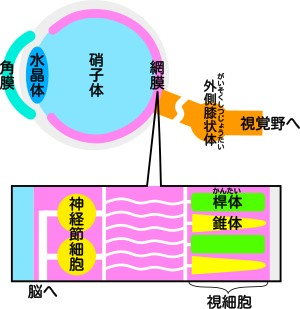
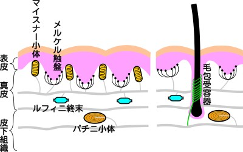

# Virtual Reality
教科書：『[バーチャルリアリティ学](https://amzn.to/3uGdfYU)』

# 目次
### 第１章バーチャルリアリティとは
* [バーチャルの意味](#1.1.1)
* [バーチャルリアリティとその三要素](#1.1.2)
* [バーチャルリアリティと人間の認知機構](#1.1.3)
* [バーチャルリアリティの概念と日本語訳](#1.1.4)
* [道具としてのバーチャルリアリティ](#1.1.5)
* [VRの基本構成要素](#1.2.1)
* [VR世界のいろいろ](#1.2.2)
* [VRをどうとらえるか](#1.2.3)
* [VRの歴史](#1.3)
### 第２章 ヒトと感覚
* [脳神経系の解剖学的構造と神経生理学の基礎](#2.1.1)
* [知覚･認知心理学の基礎](#2.1.2)
* [感覚と運動](#2.1.3)
* [視覚の受容器と神経系](#2.2.1)
* [視覚の基本特性](#2.2.2)
* [空間の知覚](#2.2.3)
* [自己運動の知覚](#2.2.4)
* [高次視覚](#2.2.5)
* [聴覚系の構造](#2.3.1)
* [聴覚の問題と音脈分離（音源分離）](#2.3.2)
* [聴覚による高さ･大きさ･音色･時間の知覚](#2.3.3)
* [聴覚による空間知覚](#2.3.4)
* [体性感覚･内臓感覚の分類と神経機構](#2.4.1)
* [皮膚感覚](#2.4.2)
* [深部感覚](#2.4.3)
* 内臓感覚
* 前庭感覚の受容器と神経系
* 平衡機能の基本特性
* 身体運動と傾斜の知覚特性
* 動揺病
* 前庭感覚と視覚の相互作用
* 味覚の受容器と神経系
* 味覚の特性
* 嗅覚の受容器と神経系
* 嗅覚の特性
* 視覚と聴覚の相互作用
* 体性感覚とその他のモダリティの相互作用
* 思考･記憶と学習
* アフォーダンス
### 第３章 バーチャルリアリティ･インタフェース
* バーチャルリアリティ･インタフェースの体系
* 物理的特性の計測
* 生理的特性の計測
* 心理的特性の計測
* [視覚ディスプレイ](#3.3.1)
* 聴覚ディスプレイ
* 前庭感覚ディスプレイ
* 味覚ディスプレイ
* 嗅覚ディスプレイ
* 体性感覚ディスプレイ
* 他の感覚との複合
* 神経系への直接刺激
* 入力と出力のループ
### 第４章 バーチャル世界の構成手法
* バーチャルリアリティのためのモデリング
* レンダリング，シミュレーションとモデル
* 処理量とデータ量のトレードオフ
* レンダリングのためのモデル
* 視覚レンダリングとモデル
* 聴覚レンダリングとモデル
* 力触覚レンダリングとモデル
* シミュレーションのためのモデル
* 空間のシミュレーション
* 物体のシミュレーション剛体のシミュレーション
* 変形のシミュレーション
* 流体のシミュレーション
* 人物のシミュレーション
***

# 第１章バーチャルリアリティとは

  

### 1.1.1 バーチャルの意味

* Existing in essence or effect though not in actual fact or form  
* みかけや形はそのものではないが、本質的あるいは効果としてはそのものである
* virtual（実質･本質）≒ real（実）
* supposed（仮想）≒ nominal（名目･表層）≒ imaginary（虚）
* バーチャルマネー、バーチャルプレジデント、バーチャルカンパニー
* バーチャルイメージ（=虚像？）、仮想敵国（≠​バーチャルエニミー）

  

### 1.1.2 バーチャルリアリティとその三要素

* みかけは現実ではないが、実質的には現実である
* ①三次元空間（三次元映画等）
* ②実時間相互作用（コンピュータゲーム等）
* ③自己投射（感覚モダリティの一致）

  

### 1.1.3 バーチャルリアリティと人間の認知機構

* 人間の感覚器による一種のバーチャルな世界（脳に投影された物自体の写像）
* 視覚･聴覚･触覚･味覚･嗅覚
* 印刷物やテレビ（色彩におけるVR）
* VRとテレイグジスタンス

  

### 1.1.4 バーチャルリアリティの概念と日本語訳

* 日本：実体のない仮想（supposed）としてのバーチャル
* 欧米：見た目は違うがほとんど実物（real）としてのバーチャル
* VR ≒ 人工現実感（≠​仮想現実感）

  

### 1.1.5 道具としてのバーチャルリアリティ

* 3Cと3Eのための道具
* ①創造（**C**reation）のための道具…創造活動･創作活動の支援
* ②制御（**C**ontrol）のための道具…ロボット･機器の制御
* ③通信（**C**ommunication）のための道具…次世代電話
* ④解明（**E**lucidation）のための道具…科学的発見のためのツール
* ⑤教育（**E**ducation）のための道具…シュミレータ
* ⑥娯楽（**E**ntertainment）のための道具…ゲーム･旅行

  

### 1.2.1 VRの基本構成要素

* ①出力システム（五感のディスプレイ）
* ②入力システム（データグローブ･位置計測･身体計測など）
* ③シュミレーションシステム（物理現象などのシュミレーション）

  

### 1.2.2 VR世界のいろいろ

* シュミレーションゲーム（計算機内で閉じられたもの）
* VR世界と遠方の世界を接続（テレイグジスタンス･テレプレゼンス）

  

### 1.2.3 VRをどうとらえるか

* AIPキューブ  
    * **A**utonomy（自律性）…シュミレーションシステム
    * **I**nteraction（対話性）…直観的入力システム
    * **P**resence（臨場感）…高臨場型ディスプレイ
    * 全天周シアター(0,0,1)、TVゲーム(0.5,0.5,0.5)
* ヒューマンインタフェース  
    * 人とシステム：三人称的（対面的に眺める）
    * 人とVR：一人称的（内側から眺める･没入的）
* インターフェースの方式  
    * 旧来：メタファ（記号的恣意性）の多用
    * VR：身体的（記号的恣意性が極少）

  

### 1.3 VRの歴史

* コンピュータ登場以前
    * 1億8000年前：南仏ラスコー洞窟の壁画
    * 18～19世紀：全天周絵画パノラマ（画家Robert Barkerによる手法）
    * 1900年：ムービングパノラマ（Mareoramaの作品）
* コンピュータグラフィック分野
    * 1967年：GROPEプロジェクト（F.Brooks･マスターアームでCG映像に触る）
    * 1968年：最初のHMD（I.Sutherland "Ultimate Display"）
* インタラクティブアート分野
    * 1969年：インタラクティブアート（M.Krueger "METAPLAY" "Videoplace"）
* アミューズメント･ゲーム分野
    * 1963年：SENSORAMA（M.Heiligのバイク体感型ゲーム）
* 航空宇宙分野
    * 1982年：スーパーコックピット（T.Furness･HMDを使った戦闘機）
    * 1985年：NASA Virtual Enviromnment（宇宙船内コックピット設計）
* ヒューマンインタフェース分野
    * 1981年：MIT "Media Room"（部屋全体を利用した空間型インターフェース）
* ロボット工学分野
    * 1982年："TELESA"（テレイグジスタンスロボット）
    * 1983年："Greenman"（テレプレゼンスロボット）
* 1989年："VR"という言葉が登場（米VPL社 EyePhoneとDataGlove） 

# 第２章 ヒトと感覚

  

### 2.1.1 脳神経系の解剖学的構造と神経生理学の基礎
[参考動画](https://www.youtube.com/watch?v=yubKCwwvNUY)

* **運動野**：体の筋肉に指令を出す
* **感覚野**：体が受取る感覚を処理
* **視覚野**：網膜からの視覚情報を処理
* **聴覚野**：聴覚情報を処理
* **頭頂連合野**：体性感覚･視覚･聴覚情報を総合的に解釈  
  

  

### 2.1.2 知覚･認知心理学の基礎

* 平面画像から立体的な情報を知覚する手がかり
    * 単眼手がかり：陰影･重なり･線遠近法･大気遠近法など
    * 両眼手がかり：輻輳角･両眼視差
* 知覚の恒常性（大きさ･形･色･明るさ）によりHMDでも作業可能

  

### 2.1.3 感覚と運動

* 運動の知覚の手がかり
    * 網膜上の対象物の移動
    * 眼球を動かし物体を追跡
* 錯覚（実際の運動と知覚される運動の不一致）
    * **誘導運動**（induced motion）：流れる雲間の月
    * **自己運動感**（ベクション/vection）：隣の列車の発車と自分
    * **仮現運動**（apperent motion）：映画やテレビの映像

  

### 2.2.1 視覚の受容器と神経系
[参考動画](https://www.youtube.com/watch?v=T72AyXHqKLo&t=650s)

* 光→角膜→水晶体→硝子体→**網膜**（retina）
* 網膜の中の**視細胞**（photoreceptor）で電気信号に変換
* 視細胞の２種類
    * **錐体**（すいたい/cone）…明所視に対応  
    （Ｓ錐体＝青）、Ｍ錐体＝緑）、Ｌ錐体（赤）の３種）
    * **桿体**（かんたい/rod）…暗所視に対応  
* 光→網膜（視細胞）→網膜（神経節細胞）→外側膝状体→視覚野へ
* [頭頂連合野](#cerebrum)：位置･運動の知覚
* [側頭連合野](#cerebrum)：形や色の知覚

  

### 2.2.2 視覚の基本特性

* **同化**：周囲の明るさと同じ方向に知覚が生じる
* **対比**：周囲の明るさとの差を強調するように逆の知覚が生じる
* **順応**と**残効**：滝の下運動と隣の岩肌
* **恒常性**：大きさ･位置･形の恒常性

  

### 2.2.3 空間の知覚

* 奥行きの手がかり
    * 眼球運動性のもの
    * 両眼性のもの（両眼視差）
    * 単眼性のもの（絵画的手がかり）
* **運動視差**：頭部運動による視点位置の変化による（車窓からの近景･遠景）

* 眼球運動のもの（調節･輻輳）
* 両眼性のもの 
    * 両眼視差：ランダムドットステレオグラム（奥行きと形の知覚）
    * 運動視差：頭部運動による視点位置の変化による（車窓からの近景･遠景）
* 単眼性のもの（絵画的手がかり）
    * 重なり･遠近法･テクスチャ勾配･速度勾配･テキストシャドー
    * 陰影（物体内の奥行き形状の知覚/光源は上方にある）
    * キャストシャドウ（物体と背景との相対的奥行き距離の知覚）

  

### 2.2.4 自己運動の知覚

* ベクション：自己運動感（隣の列車の発車と自分）
* 視覚誘導性身体動揺：（ベクションの前に自分の体が動く）

  

### 2.2.5 高次視覚

* 高次視覚：知識と注意を要する認識
* 顔倒立効果：顔に対する過学習･親近性が源（車倒立効果など）

  

### 2.3.1 聴覚系の構造
[参考動画](https://www.youtube.com/watch?v=Tt9mekn2_t8)

* 外耳（耳介→外耳道）
* 中耳（鼓膜→耳小骨＝つち･きぬた･あぶみ骨）
* 内耳（蝸牛の有毛細胞→聴神経→脳へ）
* 蝸牛の有毛細胞で周波数→神経信号に変換  

  

### 2.3.2 聴覚の問題と音脈分離（音源分離）

* 異なる音源：オンセット･タイミングが異なる、帯域が離れた成分
* 音脈：時間的･周波数的･空間的条件がつながった音の流れ

  

### 2.3.3 聴覚による高さ･大きさ･音色･時間の知覚

* 音の高さ
    * 周波数の高さ＝絶対的な高さ（ハイト）
    * 倍音効果（２倍･オクターブの周波数同士）＝相対的･周期的な高さ（クロマ）
    * 複合音：基本音と倍音（整数倍の周波数）から構成され一つの高さに知覚
* 音の大きさ
    * 振幅が大きさ（同じ周波数の場合）
    * 聴覚系の感度は周波数毎に異なる
    * エンヴェロープ（振幅の時間的変動パタン）の影響も受ける
* 音色
    * 同じ大きさ･高さを持った２音が異なる音と判断される
    * 倍音構造やエンヴェロープが異なる
* 時間（聴覚の時間解像度＝ホワイトノイズの無音部分の検出）

  

### 2.3.4 聴覚による空間知覚

* **音源定位**（聴覚による音源の位置の知覚）の定め方
    * 両耳間差（**両耳間レベル差**と**両耳間時間差**）
    * **頭部伝達関数**（HRTF/耳介や頭部による音の変化）

  

### 2.4.1 体性感覚･内臓感覚の分類と神経機構

* 感覚の種類
    * 視覚･聴覚･味覚･嗅覚･前提感覚
    * **体性感覚**（皮膚感覚と深部感覚）
    * **内蔵感覚**
* 体性感覚と内蔵感覚の４種の受容器
    1. **機械受容器**（筋肉の伸長や緊張に応答）
    1. **温度受容器**（体内外の温度に応答）
    1. **化学受容器**（pH＝水溶液の状態に応答）
    1. **侵害受容器**（体に障害を引き起こす障害に応答）

  

### 2.4.2 皮膚感覚（体性感覚①）

* 皮膚の２部：①無毛部（手指･指紋、手掌･掌紋）②有毛部分（毛穴）
* 皮膚の３層：①表皮 ②真皮 ③皮下組織
* **触覚**：機械受容器（マイスナー小体、メルケル触盤、フィルニ終末、パチニ小体、毛包受容体）
* **温度感覚**：温覚受容器（40〜45℃）、冷覚受容器（30℃付近）
* **痛覚**：皮膚の痛み（体性痛覚-表在性痛覚）、急性の痛みと慢性の痛み
 

  

### 2.4.3 深部感覚（体性感覚②）

* 検出内容：四肢（両手両足）相互の動きや力など
* 受容器：筋肉、腱、関節に存在
* 深部感覚の３つの感覚
    1. 位置覚：四肢の相対的位置
    1. 運動覚：動かす速さと方向
    1. 力覚：関節位置を保持するための筋力
* 深部痛覚：筋肉･骨･関節･結合組織などからの痛み

  

### 2.4.4 内臓感覚

  

### 2.5.1 前庭感覚の受容器と神経系

  

### 2.5.2 平衡機能の基本特性

  

### 2.5.3 身体運動と傾斜の知覚特性

  

### 2.5.4 動揺病

  

### 2.5.5 前庭感覚と視覚の相互作用

  

### 2.6.1 味覚の受容器と神経系

  

### 2.6.2 味覚の特性

  

### 2.6.3 嗅覚の受容器と神経系

  

### 2.6.4 嗅覚の特性

  

### 2.7.1 視覚と聴覚の相互作用

  

### 2.7.2 体性感覚とその他のモダリティの相互作用

  

### 2.7.3 思考･記憶と学習

  

### 2.7.4 アフォーダンス

# 第３章 バーチャルリアリティ･インタフェース

  

### 3.1 バーチャルリアリティ･インタフェースの体系

  

### 3.2.1 物理的特性の計測

  

### 3.2.2 生理的特性の計測

  

### 3.2.3 心理的特性の計測

  

### 3.3.1 視覚ディスプレイ

* **2眼式**立体視方式：主に**両眼視差**により実現
* **液晶シャッターメガネ**を利用したもの
* **偏光メガネ**を利用したもの
* **パララックスバリア**を利用したもの
* 頭部搭載型ディスプレイ：**HMD**（特殊な光学系が必要）
* 頭部搭載型プロジェクタ：**再帰性反射機能**（特殊な光学系は不要）
* **体積走査型ディスプレイ**：LEDアレイ走査型、回展スクリーン式
* **没入ディスプレイ**：大型平面スクリーン単体、多面体スクリーン、曲面スクリーン

  

### 3.3.2 聴覚ディスプレイ

  

### 3.3.3 前庭感覚ディスプレイ

  

### 3.3.4 味覚ディスプレイ

  

### 3.3.5 嗅覚ディスプレイ

  

### 3.3.6 体性感覚ディスプレイ

  

### 3.3.7 他の感覚との複合

  

### 3.3.8 神経系への直接刺激

  

### 3.4 入力と出力のループ

# 第４章 バーチャル世界の構成手法

  

### 4.1.1 バーチャルリアリティのためのモデリング

  

### 4.1.2 レンダリング、シミュレーションとモデル

  

### 4.1.3 処理量とデータ量のトレードオフ

  

### 4.2.1 レンダリングのためのモデル

  

### 4.2.2 視覚レンダリングとモデル

  

### 4.2.3 聴覚レンダリングとモデル

  

### 4.2.4 力触覚レンダリングとモデル

  

### 4.3.1 シミュレーションのためのモデル

  

### 4.3.2 空間のシミュレーション

  

### 4.3.3-1 物体のシミュレーション剛体のシミュレーション

  

### 4.3.3-2 変形のシミュレーション

  

### 4.3.3-3 流体のシミュレーション

  

### 4.3.4 人物のシミュレーション